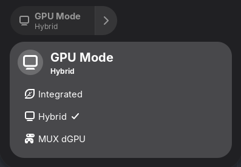
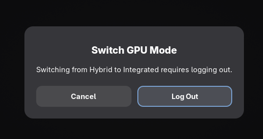
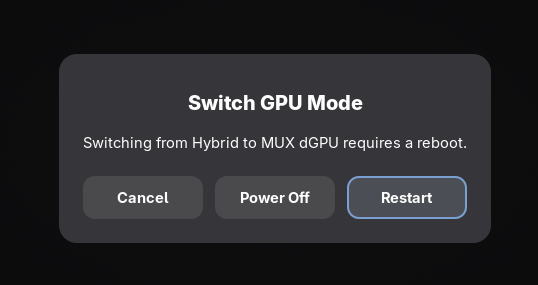

# ASUS GPU Control

GNOME Shell extension for switching GPU modes on ASUS laptops using [supergfxctl](https://gitlab.com/asus-linux/supergfxctl).

Adds a Quick Settings toggle for switching between Integrated, Hybrid, and MUX dGPU modes with confirmation dialogs that handle logout/reboot automatically.

Built as a GNOME 49 replacement for the now-incompatible [supergfxctl-gex](https://gitlab.com/asus-linux/supergfxctl-gex).



## Features

- Quick Settings toggle with dropdown menu for GPU mode selection
- Click the toggle to switch between Hybrid and Integrated
- Confirmation dialog before switching, with the appropriate action:
  - **Hybrid <-> Integrated**: Logs you out (daemon needs session to end for driver swap)
  - **Anything involving MUX**: Offers Restart or Power Off (firmware is written immediately)
- Pending state detection (shows status if a switch was initiated via CLI)
- Cancel-back support: switch back to your booted mode without rebooting if you changed mode via CLI




## Requirements

- GNOME Shell 49
- [supergfxctl](https://gitlab.com/asus-linux/supergfxctl) with `supergfxd` running
- ASUS laptop with supported GPU switching (tested on ASUS TUF A15 2022)

## Installation

### From source

```sh
git clone https://github.com/alhnesn/asus-gpu-control-gex.git
cd asus-gpu-control-gex
make install
```

Then enable:

```sh
gnome-extensions enable asus-gpu-control@alhnesn
```

Log out and back in to load the extension.

### From zip

```sh
make zip
gnome-extensions install asus-gpu-control@alhnesn.zip --force
gnome-extensions enable asus-gpu-control@alhnesn
```

### Uninstall

```sh
gnome-extensions disable asus-gpu-control@alhnesn
make uninstall
```

## GPU mode behavior

| From | To | Action | What happens |
|---|---|---|---|
| Hybrid | Integrated | Logout | Daemon swaps drivers after session ends |
| Integrated | Hybrid | Logout | Daemon swaps drivers after session ends |
| Hybrid/Integrated | MUX dGPU | Reboot | Firmware MUX switch written immediately |
| MUX dGPU | Hybrid/Integrated | Reboot | Firmware MUX switch written immediately |

> **Note:** For logout-type switches, reboot/shutdown does **not** work — the daemon is killed before it can finish the driver swap. Only a proper logout allows the switch to complete.

## License

[MIT](LICENSE)
